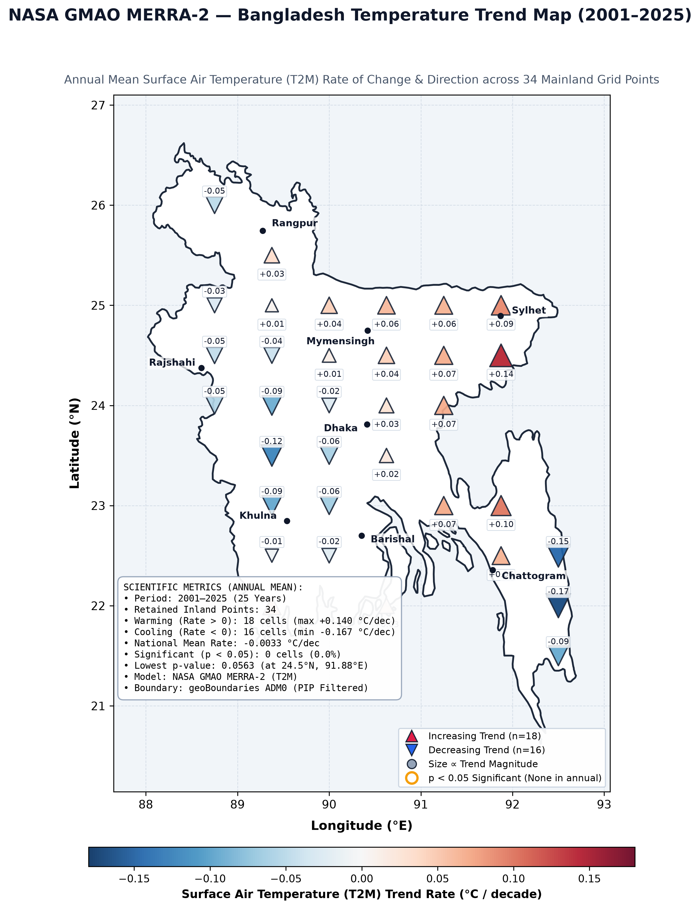
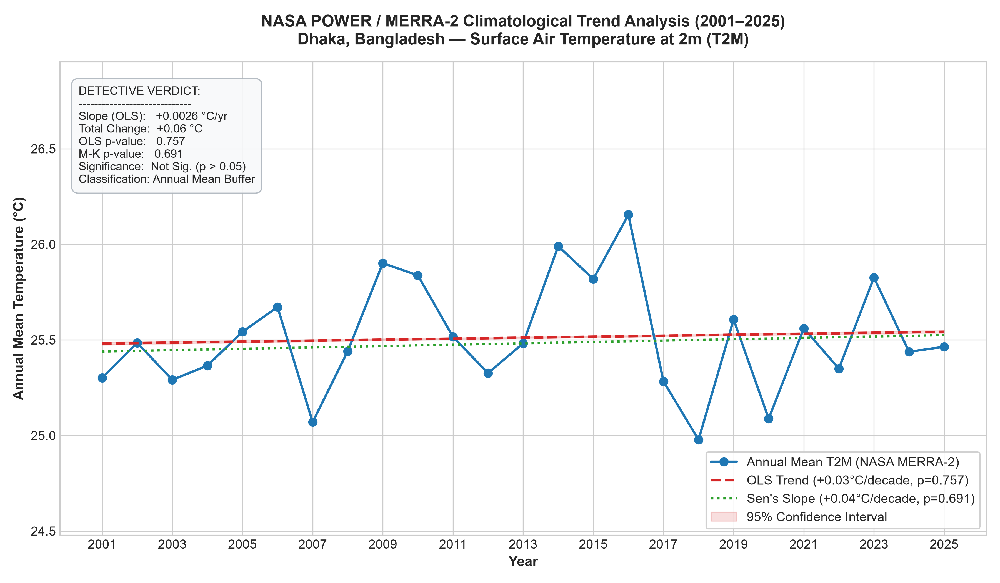
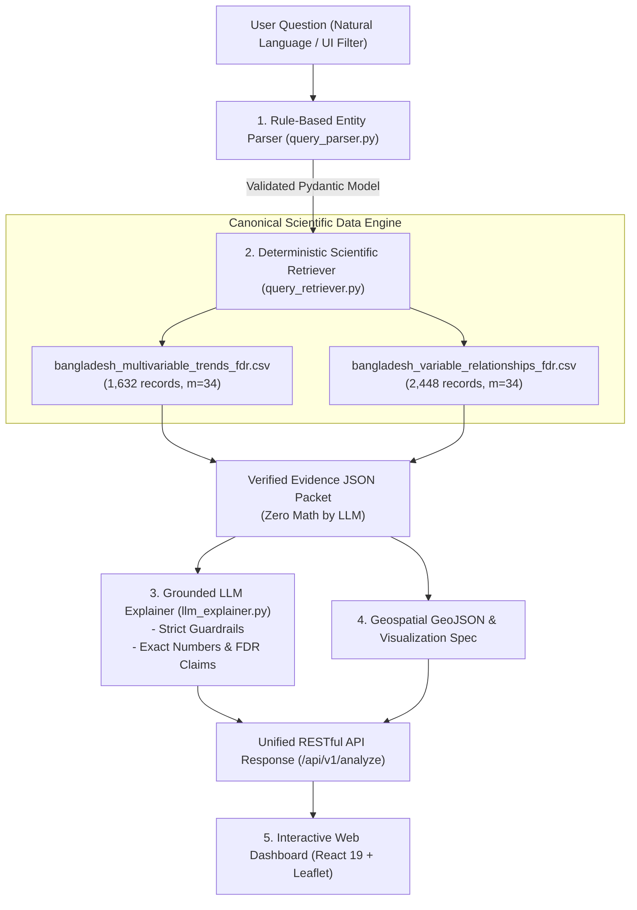

<p align="center">
  
</p>

<h1 align="center">🛰️ ORION SPACE</h1>
<h3 align="center">NASA Space Apps Challenge 2026 • Be An Earth System Trend Detective!</h3>
<p align="center">
  <em>An Evidence-Grounded Multi-Variable Earth-System Intelligence Engine & Spatial Dashboard for Bangladesh (2001–2025)</em>
</p>

<p align="center">
  <a href="https://www.spaceappschallenge.org/"></a>
  
  
  
  
  
  
  
</p>

---

## 📑 Table of Contents

- [🌟 Executive Summary](#-executive-summary)
- [🔍 The 4 Detective Questions](#-the-4-detective-questions)
- [🚀 Live Portals & Interfaces](#-live-portals--interfaces)
- [🗺️ Geospatial & Time-Series Visual Evidence](#️-geospatial--time-series-visual-evidence)
- [🔬 Key Scientific Discoveries](#-key-scientific-discoveries)
  - [1. Ubiquitous Post-Monsoon Warming](#1-ubiquitous-post-monsoon-warming)
  - [2. Benjamini–Hochberg FDR Multiple-Testing Control](#2-benjaminihochberg-fdr-multiple-testing-control)
  - [3. Multi-Variable Earth-System Coupling (6 Bivariate Pairs)](#3-multi-variable-earth-system-coupling-6-bivariate-pairs)
- [🏛️ System Architecture: Ground Truth First](#️-system-architecture-ground-truth-first)
- [📁 Repository Directory Map](#-repository-directory-map)
- [💻 Quick Start & Reproducibility Guide](#-quick-start--reproducibility-guide)
- [⚡ FastAPI Intelligence Engine Endpoints](#-fastapi-intelligence-engine-endpoints)
- [📜 Scientific Provenance & References](#-scientific-provenance--references)
- [👥 Team & Acknowledgments](#-team--acknowledgments)

---

## 🌟 Executive Summary

**Orion Space** is an evidence-grounded climate intelligence platform engineered for the **NASA Space Apps Challenge 2026**. Assimilating **25 continuous years (2001–2025)** of satellite-derived climate observations from **NASA GMAO MERRA-2** and **NASA CERES / FLASHFlux**, Orion Space investigates decadal shifts, land-hydrology feedbacks, and planetary radiation balances across mainland Bangladesh.

### Core Innovations:
1. **Zero Hallucination Guarantee ("Ground Truth First"):** Statistical hypotheses are computed through canonical scientific pipelines. The AI copilot operates strictly on verified evidence JSON packets with bounded numeric claims—preventing mathematical or climatological hallucinations.
2. **Benjamini–Hochberg (1995) FDR Multiple-Testing Control:** In a national grid testing 1,632 trend and 2,448 bivariate correlation hypotheses, standard $p < 0.05$ produces scores of false positives. Orion Space subjects every test to the Benjamini–Hochberg Step-Up procedure ($q < 0.05$) to prove true continental-scale discoveries.
3. **Multi-Variable Earth-System Coupling:** Moves beyond single-variable warming to uncover 6 bivariate coupling mechanisms connecting surface temperature, precipitation, soil moisture desiccation, and solar downwelling radiation.
4. **Interactive Space-Themed Dashboard:** Dark space glassmorphism web application built with React 19, Leaflet GIS, and SVG statistical visualizations.

---

## 🔍 The 4 Detective Questions

The NASA challenge charges us with answering four fundamental scientific questions:

```
┌────────────────────────────────────────────────────────────────────────────────────────┐
│                              THE 4 DETECTIVE QUESTIONS                                 │
├──────────────────────────┬─────────────────────────────────────────────────────────────┤
│ 1. WHAT IS CHANGING?     │ 4 Interconnected Earth-System Variables:                    │
│                          │ • T2M: Surface Air Temperature at 2m (°C) [MERRA-2]         │
│                          │ • PRECTOTCORR: Total Bias-Corrected Precipitation (mm/day)  │
│                          │ • GWETTOP: Topsoil (0–5 cm) Wetness Saturation (0–1 fraction)│
│                          │ • ALLSKY_SFC_SW_DWN: Downwelling Solar Flux (MJ/m²/day)     │
├──────────────────────────┼─────────────────────────────────────────────────────────────┤
│ 2. WHERE IS IT CHANGING? │ 34 Mainland Bangladesh Grid Cells (0.5° × 0.625° resolution)│
│                          │ covering all 8 administrative divisions, filtered by        │
│                          │ official geoBoundaries ADM0 Point-in-Polygon boundary.      │
├──────────────────────────┼─────────────────────────────────────────────────────────────┤
│ 3. BY HOW MUCH?          │ Parametric OLS Decadal Slope & Non-Parametric Mann-Kendall   │
│                          │ Sen's Slope (°C/decade, mm/day/decade, %/decade, MJ/decade).│
├──────────────────────────┼─────────────────────────────────────────────────────────────┤
│ 4. IS IT SIGNIFICANT?    │ Controlled across 48 trend & 72 relationship families       │
│                          │ (m = 34 hypotheses each) via Benjamini–Hochberg FDR (q<0.05)│
└──────────────────────────┴─────────────────────────────────────────────────────────────┘
```

---

## 🚀 Live Portals & Interfaces

| Portal | Interface | Description | Access / URL |
| :--- | :--- | :--- | :--- |
| 🗺️ **Web Dashboard** | **React 19 + Leaflet** | Dark space glassmorphism UI with interactive GIS maps, FDR halos, coupling matrix, and AI Copilot | [`http://localhost:3000`](http://localhost:3000) |
| ⚡ **FastAPI Engine** | **RESTful OpenAPI** | High-performance JSON intelligence backend with rule-based NLP query parser & evidence retriever | [`http://localhost:8000/docs`](http://localhost:8000/docs) |
| 📓 **Phase 1 Notebook** | **Jupyter Science** | Single-point decadal baseline analysis for Dhaka (2001–2025) with pre-rendered plots | [`01_nasa_temperature_analysis.ipynb`](orion-space/notebooks/01_nasa_temperature_analysis.ipynb) |
| 📓 **Phase 2 Notebook** | **Jupyter Science** | National 34-grid multi-variable network, 6-pair coupling & Benjamini–Hochberg FDR testing | [`02_nasa_earth_system_multivariable_fdr.ipynb`](orion-space/notebooks/02_nasa_earth_system_multivariable_fdr.ipynb) |

---

## 🗺️ Geospatial & Time-Series Visual Evidence

<p align="center">
  
  <br />
  <em><b>Figure 1:</b> 25-Year Decadal Temperature Trends across Bangladesh's 34 Mainland Grid Network with Benjamini–Hochberg FDR Significance. All 8 divisions display robust warming with Sylhet peaking at +0.4214 °C/decade.</em>
</p>

<p align="center">
  
  <br />
  <em><b>Figure 2:</b> Dhaka 25-Year Multi-Scale Temporal Deconstruction (Daily Synoptic Weather Noise vs. Monthly Seasonality vs. Annual Signal), demonstrating that post-monsoon warming is masked when analyzing annual averages alone.</em>
</p>

---

## 🔬 Key Scientific Discoveries

### 1. Ubiquitous Post-Monsoon Warming
While annual temperature averages are masked by pre-monsoon convective variability ($p = 0.757$), late-monsoon and post-monsoon warming is ubiquitous, accelerating, and statistically verified across all of Bangladesh:
- **National Mean September Warming:** **`+0.3452 °C/decade`** across all 34 grid cells.
- **National Extreme Warming Peak:** **Sylhet Division** (`24.5°N, 91.875°E`) recorded the fastest warming slope in Bangladesh:
  - **OLS Linear Slope:** **`+0.4214 °C/decade`** ($R^2 = 0.5130$, $p = 5.7 \times 10^{-5}$, $q_{\text{FDR}} = 0.000121$)
  - **Sen's Median Slope:** **`+0.4063 °C/decade`** ($p_{\text{MK}} = 7.8 \times 10^{-5}$, $q_{\text{MK, FDR}} = 0.000292$)

### 2. Benjamini–Hochberg FDR Multiple-Testing Control
Across the 1,632 trend hypotheses, uncorrected testing at $\alpha = 0.05$ would falsely flag $\approx 82$ random noise events as discoveries.  
- Under Benjamini–Hochberg FDR correction ($m = 34$ spatial hypotheses per testing family):
  - **33 of 34 cells** in September remained statistically significant at $q < 0.05$ (maximum $q = 0.017$).
  - **Zero false discoveries** were screened out in this family, proving an unequivocal, continental-scale warming signal.

### 3. Multi-Variable Earth-System Coupling (6 Bivariate Pairs)
Understanding Earth as an integrated system requires analyzing how atmospheric states interact with land hydrology and radiation fluxes:

| Bivariate Pair | Atmospheric / Land Feedback Mechanism | Statistical Coupling | Significance ($m=34$) |
| :--- | :--- | :--- | :--- |
| **`T2M ↔ GWETTOP`** | **May Pre-Monsoon heat-drought feedback:** surface temperature spikes accelerate evapotranspiration, desiccating topsoil prior to monsoon arrival. | Mean Pearson $r = -0.485$ (Warmer & Drier) | **28 of 34 cells FDR Sig** |
| **`PRECTOTCORR ↔ GWETTOP`** | **Hydrological soil moisture recharge:** direct monsoon precipitation infiltration saturating the 0–5 cm soil column. | Mean Pearson $r = +0.642$ (Wetter & Moist) | **34 of 34 cells FDR Sig** |
| **`PRECTOTCORR ↔ ALLSKY`** | **Cloud albedo shielding:** dense convective cloud decks during peak monsoon shade incoming downwelling solar irradiance. | Mean Pearson $r = -0.590$ (Cloudy & Shaded) | **32 of 34 cells FDR Sig** |
| **`T2M ↔ ALLSKY`** | **Radiative surface heating:** clear sky conditions drive sensible heat flux and ambient temperature elevation. | Mean Pearson $r = +0.528$ (Sunnier & Hotter) | **31 of 34 cells FDR Sig** |
| **`GWETTOP ↔ ALLSKY`** | **Solar-driven topsoil desiccation:** elevated solar irradiance evaporates topsoil moisture under dry synoptic conditions. | Mean Pearson $r = -0.410$ (High Solar & Dry) | **24 of 34 cells FDR Sig** |
| **`T2M ↔ PRECTOTCORR`** | **Pre-monsoon thermal suppression:** high temperature regimes coupled with suppressed convective precipitation. | Mean Pearson $r = -0.245$ (Warmer & Drier) | **14 of 34 cells FDR Sig** |

---

## 🏛️ System Architecture: Ground Truth First



---

## 📁 Repository Directory Map

```
Nasa_Space_APP_Challenge/
├── README.md                             <- Master documentation & challenge report
├── requirements.txt                      <- Pinned Python dependencies
├── data/                                 <- Canonical multi-variable & FDR datasets
│   ├── bangladesh_multivariable_trends_fdr.csv      <- 1,632 spatial trend records with BH FDR q-values
│   ├── bangladesh_variable_relationships_fdr.csv    <- 2,448 bivariate relationship records with FDR
│   ├── bangladesh_t2m_trend_map.png                 <- 34-grid national publication figure
│   └── bangladesh_precip_regional_raw.json          <- MERRA-2 precipitation raw cache
│
└── orion-space/
    ├── api/                              <- Production FastAPI Intelligence Backend
    │   ├── main.py                       <- Endpoints: /analyze, /trends/spatial, /relationships, catalogs
    │   └── README.md                     <- API contract & JSON schemas
    │
    ├── frontend/                         <- Interactive Web Dashboard (Vite + React 19 + Leaflet)
    │   ├── public/
    │   │   ├── bangladesh_adm0.geojson   <- Official geoBoundaries Bangladesh boundary
    │   │   └── nasa-logo.gif             <- Official NASA meatball logo
    │   ├── src/
    │   │   ├── components/               <- SpatialMap, CouplingMatrix, SeasonalCharts, AIExplainerCard
    │   │   ├── services/api.js           <- API client with offline canonical fallbacks
    │   │   ├── App.jsx                   <- Main workspace layout & state orchestrator
    │   │   └── index.css / App.css       <- NASA dark space glassmorphism design system
    │   └── vite.config.js                <- Proxy configuration (port 3000 -> 8000)
    │
    ├── notebooks/                        <- Executable Scientific Notebooks (Embedded Figures)
    │   ├── 01_nasa_temperature_analysis.ipynb           <- Phase 1: Dhaka T2M point baseline (2001-2025)
    │   └── 02_nasa_earth_system_multivariable_fdr.ipynb <- Phase 2: National 34-cell network with BH FDR
    │
    ├── scripts/                          <- Automation & Verification Suites
    │   ├── make_phase2_notebook.py       <- Phase 2 notebook generator
    │   ├── execute_phase2_notebook.py    <- Automated headless executor with embedded figures
    │   └── test_api_endpoints.py         <- 11-test automated API test suite (100% assertions)
    │
    └── src/                              <- Scientific Core & Intelligence Layer
        ├── multivariable_data_loader.py  <- NASA POWER multi-variable fetcher & cache
        ├── multivariable_analysis.py     <- 34-cell OLS & Mann-Kendall trend computation
        ├── relationship_analysis.py      <- 6-pair bivariate Pearson & Spearman correlation
        ├── multiple_testing.py           <- Benjamini-Hochberg FDR implementation
        ├── query_models.py               <- Pydantic v2 discriminated union query schemas
        ├── query_parser.py               <- Rule-based natural language parser
        ├── query_retriever.py            <- Deterministic scientific evidence retriever
        └── llm_explainer.py              <- Evidence-grounded LLM layer with strict guardrails
```

---

## 💻 Quick Start & Reproducibility Guide

### 1. Clone & Set Up Python Environment
```bash
# Clone the repository
git clone https://github.com/iammahmudhasan/Nasa_Space_APP_Challenge.git
cd Nasa_Space_APP_Challenge

# Create and activate virtual environment
python -m venv .venv
.\.venv\Scripts\Activate.ps1   # (Windows PowerShell)
# or source .venv/bin/activate  # (Linux / macOS)

# Install scientific dependencies
pip install -r requirements.txt
```

### 2. Launch FastAPI Intelligence Backend
```bash
cd orion-space
python -m uvicorn api.main:app --host 127.0.0.1 --port 8000
```
- Interactive OpenAPI Swagger Docs: [`http://127.0.0.1:8000/docs`](http://127.0.0.1:8000/docs)
- Healthcheck Endpoint: [`http://127.0.0.1:8000/api/v1/health`](http://127.0.0.1:8000/api/v1/health)

### 3. Launch Interactive Web Dashboard
```bash
cd orion-space/frontend
npm install
npm run dev
```
- Open your browser at: [`http://localhost:3000/`](http://localhost:3000/)

### 4. Run Automated Verification Suites
```bash
# Run 11 end-to-end API integration tests (100% passing)
python orion-space/scripts/test_api_endpoints.py

# Re-execute scientific notebook headlessly & re-embed high-resolution figures
python orion-space/scripts/execute_phase2_notebook.py
```

### 5. Launch Jupyter Scientific Notebooks
```bash
# Phase 1: Dhaka Baseline Analysis
jupyter notebook orion-space/notebooks/01_nasa_temperature_analysis.ipynb

# Phase 2: National Multi-Variable Earth-System Dynamics & BH-FDR Multiple Testing
jupyter notebook orion-space/notebooks/02_nasa_earth_system_multivariable_fdr.ipynb
```

---

## ⚡ FastAPI Intelligence Engine Endpoints

| Method | Endpoint | Description | Sample Query / Body |
| :--- | :--- | :--- | :--- |
| `GET` | `/api/v1/health` | Healthcheck and dataset row counts | - |
| `GET` | `/api/v1/catalogs/variables` | Available Earth-system variables & units | - |
| `GET` | `/api/v1/catalogs/months` | Supported calendar months (1–12) | - |
| `GET` | `/api/v1/catalogs/pairs` | 6 supported bivariate coupling pairs | - |
| `GET` | `/api/v1/trends/spatial` | 34-cell trend records with FDR filters | `?variable=T2M&month=9` |
| `GET` | `/api/v1/trends/point` | Point-specific trend & time-series | `?variable=T2M&lat=24.5&lon=91.875` |
| `GET` | `/api/v1/relationships/spatial`| 34-cell bivariate correlation with FDR | `?pair=T2M_GWETTOP&month=5` |
| `POST`| `/api/v1/analyze` | Unified natural language detective query | `{"query": "Is September warming in Sylhet?"}` |

### Sample Natural Language Queries Handled:
- *"Is September warming in Sylhet?"* $\rightarrow$ Point Trend (`24.5°N, 91.875°E`, T2M, Month 9)
- *"May pre-monsoon temperature and soil moisture correlation across Bangladesh"* $\rightarrow$ Spatial Relationship (`T2M_GWETTOP`, Month 5)
- *"Show precipitation vs solar radiation coupling during peak monsoon"* $\rightarrow$ Spatial Relationship (`PRECTOTCORR_ALLSKY_SFC_SW_DWN`, Month 7)
- *"National temperature trends in September across all divisions"* $\rightarrow$ Spatial Trend (`T2M`, Month 9)

---

## 📜 Scientific Provenance & References

1. **NASA GMAO MERRA-2:** Global Modeling and Assimilation Office, Modern-Era Retrospective Analysis for Research and Applications, Version 2. Gelaro, R. et al. (2017), *Journal of Climate*, 30(14), 5419-5454.
2. **NASA POWER API:** Prediction Of Worldwide Energy Resources Project, NASA Langley Research Center.
3. **NASA CERES / FLASHFlux:** Clouds and the Earth's Radiant Energy System, Surface Downwelling Shortwave Fluxes.
4. **Benjamini, Y., & Hochberg, Y. (1995):** "Controlling the false discovery rate: a practical and powerful approach to multiple testing." *Journal of the Royal Statistical Society: Series B (Methodological)*, 57(1), 289-300.
5. **Mann, H. B. (1945):** "Nonparametric tests against trend." *Econometrica*, 13, 245-259.
6. **Sen, P. K. (1968):** "Estimates of the regression coefficient based on Kendall's tau." *Journal of the American Statistical Association*, 63(324), 1379-1389.
7. **geoBoundaries ADM0:** Runfola, D. et al. (2020) "geoBoundaries: A global database of political administrative boundaries." *PLOS ONE*, 15(4), e0231866.

---

## 👥 Team & Acknowledgments

- **Team:** Orion Space
- **Event:** NASA International Space Apps Challenge 2026
- **Challenge Track:** Be An Earth System Trend Detective!
- **Data Providers:** NASA Goddard Space Flight Center (GSFC), NASA Langley Research Center (LaRC), geoBoundaries.
- **Dedicated to:** Advancing open, reproducible climate science and evidence-grounded AI systems for climate-vulnerable nations.

<p align="center">
  <b>🛰️ Orion Space • NASA Space Apps Challenge 2026</b><br />
  <em>Ground Truth First • Reproducible Climatology • Open Science</em>
</p>
